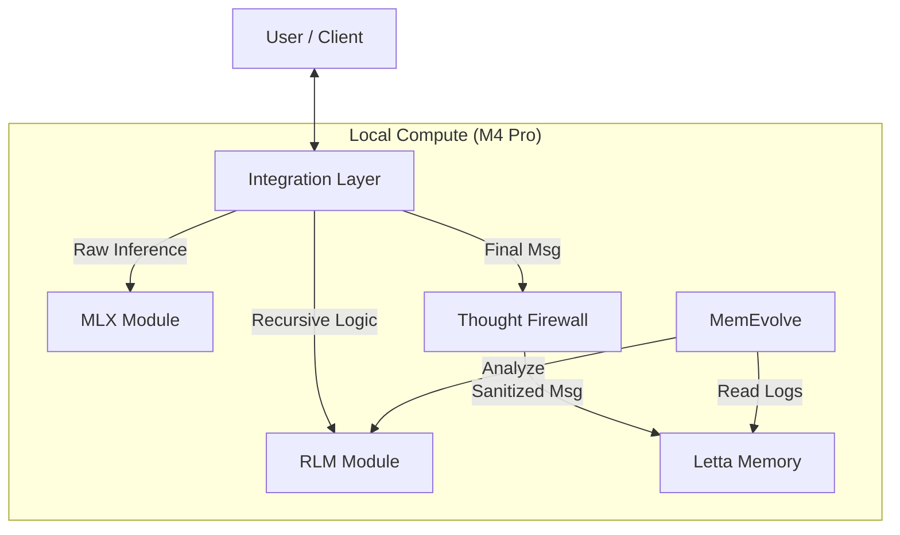

# Design Document

## Overview

Nexus Core implements a modular AI operating system architecture that provides persistent memory, recursive reasoning, and evolutionary optimization while maintaining complete data sovereignty. The system consists of five core modules connected through an Integration Layer that acts as the central dispatcher and implements critical security mechanisms like the Thought Firewall.

**RLM Integration Strategy:**
RLM serves as the core reasoning engine invoked programmatically when needed:
- **Inference Phase**: RLM is invoked for complex queries requiring long context processing, memory analysis, or recursive reasoning
- **Evolution Phase**: MemEvolve invokes RLM to analyze large interaction logs and multi-session patterns for capability improvement and tool synthesis
- **Conditional Usage**: RLM is not used for every request - only when context size, complexity, or specific analysis requirements exceed standard processing capabilities

## Architecture

The system follows a hub-and-spoke architecture with the Integration Layer at the center:



## Components and Interfaces

### Integration Gateway (`integration/core/nexus_gateway.py`)

**Role:** Central Dispatcher and Security Layer

**Key Responsibilities:**
- Route requests between modules
- Determine when to invoke RLM based on context size and complexity
- Implement stream splitting for thought separation
- Enforce the Thought Firewall security mechanism

**RLM Invocation Logic:**
- **Context Size Threshold**: Invoke RLM when context exceeds ~8k tokens
- **Complexity Triggers**: Multi-document analysis, code analysis, long conversation history queries
- **Memory Analysis**: When queries require deep exploration of Letta's memory system
- **Fallback**: Use standard MLX inference for simple queries

**Interface Design:**
- **Stream A (User):** Passthrough of all tokens (Thoughts + Text)
- **Stream B (Letta):** Buffer tokens, strip `<thought>` tags using regex/heuristics, flush only sanitized text to Letta API

**Methods:**
```python
class IntegrationGateway:
    def route_request(self, user_input: str) -> Response
    def should_use_rlm(self, query: str, context_size: int) -> bool
    def split_stream(self, raw_output: str) -> (str, str)  # (thoughts, content)
    def sanitize_for_letta(self, raw_output: str) -> str
```

### RLM Service (`integration/core/rlm_service.py`)

**Role:** Recursive Reasoning Engine with REPL-Based Context Exploration and Letta Memory Integration

**Design:** Wrapper around the existing RLM library that integrates with Letta's memory system, providing access to conversation history, core memory, and archival memory as context variables.

**Key Architecture:**
- **Context as Variable**: Large contexts are stored as Python variables, not passed in prompts
- **REPL Environment**: LLM writes Python code to explore context programmatically
- **Iterative Processing**: Multi-turn conversation where LLM can peek, search, and analyze context
- **Recursive Capability**: LLM can spawn sub-processes for different parts of context
- **FINAL() Termination**: LLM outputs `FINAL("answer")` when ready to return result
- **Letta Memory Integration**: Access to conversation history, core memory, and archival memory as context variables

**Interface:**
```python
class RLMService:
    def __init__(self, letta_client: LettaClient):
        self.letta_client = letta_client
        self.rlm = RLM(model="gpt-4o-mini")
    
    def process_with_memory(self, query: str, agent_id: str, user_id: str) -> str:
        """Process query with full Letta memory context"""
        
    def analyze_evolution_data(self, query: str, session_logs: List[dict]) -> str:
        """Process large interaction logs for MemEvolve analysis"""
        
    def _build_memory_context(self, agent_id: str, user_id: str) -> dict:
        """Build context variables from Letta memory system"""
```

**REPL Environment with Letta Integration:**
- `context`: The primary document/data as a string variable
- `query`: The user's question
- `conversation_history`: List of recent messages from Letta
- `core_memory`: Agent's core memory blocks (persona, human info)
- `archival_memory`: Searchable long-term memory from Letta
- `recursive_llm(sub_query, sub_context)`: Function to recursively process sub-parts
- `re`: Regex module for pattern matching and search
- Safe Python execution with RestrictedPython

**Example RLM Workflow with Letta Memory:**
1. User asks: "Based on our conversation history, what patterns do you see in my coding questions?"
2. RLM receives query with Letta memory as context variables (not in prompt)
3. LLM writes: `print(f"Conversation history: {len(conversation_history)} messages")` to check available data
4. LLM writes: `coding_questions = [msg for msg in conversation_history if 'code' in msg['content'].lower()]` to filter
5. LLM writes: `patterns = re.findall(r'(Python|JavaScript|React)', str(coding_questions))` to extract patterns
6. LLM writes: `FINAL(f"Patterns found: {', '.join(set(patterns))}")` to return answer

**Letta Memory Integration Details:**
- **Conversation History**: Recent messages from current session and previous sessions
- **Core Memory**: Agent persona, human information, and key facts
- **Archival Memory**: Long-term searchable memory with semantic search capabilities
- **Memory Queries**: RLM can query Letta's memory system programmatically within REPL

**Key Benefits:**
- **No Context Rot**: Context never passed in prompts, avoiding degradation
- **Token Efficiency**: Uses ~2-3k tokens vs 95k+ for direct approaches
- **Adaptive Exploration**: LLM can strategically explore only relevant memory parts
- **Recursive Processing**: Can break down large memory contexts into manageable chunks
- **Memory-Aware Reasoning**: Full access to agent's persistent memory for context-aware responses

### Letta Memory Engine (`letta/`)

**Role:** Persistent State Management

**Interface:** Standard Letta API with custom integration points
- Receives only sanitized messages (no thought traces)
- Provides session logs for MemEvolve analysis
- Maintains user and agent state across sessions

### MemEvolve Optimization Engine (`memevolve/`)

**Role:** Post-hoc Analysis and Tool Synthesis

**Design:** Standalone daemon or cron job with integrated security validation

**Interface:**
- Connects to `data/letta/sqlite.db` (read-only)
- Writes new tools to `integration/tools/` after security validation
- Registers tools via `integration/core/nexus_mcp.py`

**Workflow:**
1. Analyze completed sessions from Letta
2. Identify capability gaps using RLM analysis
3. Synthesize new Python tools
4. **Security Validation:** Pass tools through Tool_Sandbox for safety checks
5. Register approved tools for future use

**Security Integration:**
- All generated tools must pass Tool_Sandbox validation
- Rejected tools are logged with security violation details
- Maintains audit trail of all tool generation attempts

### Tool Sandbox (`integration/core/security/tool_sandbox.py`)

**Role:** Security Validation for MemEvolve-Generated Tools

**Key Responsibilities:**
- Validate tool code for safety before registration
- Prevent access to system files, network resources, or arbitrary command execution
- Block attempts to modify agent personas or security settings
- Maintain whitelist of approved tool patterns

**Interface:**
```python
class ToolSandbox:
    def validate_tool(self, tool_code: str) -> ValidationResult
    def check_security_violations(self, code: str) -> List[SecurityViolation]
    def is_whitelisted_pattern(self, code: str) -> bool
```

**Security Checks:**
- Static code analysis for dangerous imports and functions
- Pattern matching against known malicious code signatures
- Validation against approved tool templates
- Resource access restriction enforcement

### Persona Lock (`integration/core/security/persona_lock.py`)

**Role:** Agent Identity Protection System

**Key Responsibilities:**
- Prevent agents from modifying their persona definitions
- Block unauthorized changes to core memory blocks
- Maintain immutable backups of original configurations
- Log all persona modification attempts

**Interface:**
```python
class PersonaLock:
    def protect_persona(self, agent_id: str) -> bool
    def validate_modification(self, agent_id: str, changes: dict) -> bool
    def restore_persona(self, agent_id: str) -> bool
```

**Protection Mechanisms:**
- Read-only enforcement on persona configuration files
- API call interception for persona modification attempts
- Cryptographic checksums for persona integrity validation
- Secure backup and restore capabilities

### MLX Inference Layer (`mlx/`)

**Role:** Local AI Computation with Advanced Optimization

**Design:** Apple Silicon optimized inference engine with flexible configuration and speculative decoding
- Handles all LLM and embedding computations
- Ensures zero external API calls
- Optimized for M4 Pro architecture with unified memory

**Speculative Decoding Architecture:**
- **Draft Model**: Fast small model (1B-3B parameters) for initial token prediction
- **Target Model**: High-quality model (14B+ parameters) for verification and final output
- **Acceleration**: 1.5-3x inference speedup while maintaining target model quality
- **Adaptive Selection**: Choose configuration based on query complexity and latency requirements

**Configuration Options:**
- **Standard Mode**: Single model inference with configurable quantization (4-bit, 8-bit, 16-bit)
- **Speculative Mode**: Draft + target model combination for accelerated inference
- **Experimental Mode**: Custom model combinations and optimization strategies
- **Adaptive Mode**: Dynamic model selection based on context and performance requirements

**Performance Features:**
- **Memory Management**: Adaptive model loading/unloading based on usage patterns
- **KV Cache Optimization**: Efficient attention computation and memory usage
- **Batch Processing**: Multiple request handling for improved throughput
- **Hardware Utilization**: Metal Performance Shaders and Neural Engine integration

**Interface:**
```python
class MLXService:
    def __init__(self, config: Union[str, dict]):
        # Support "standard", "speculative", "experimental" or custom config
        
    def inference(self, prompt: str, model_hint: str = None) -> str:
        # Adaptive model selection based on prompt complexity
        
    def configure_speculative(self, draft_model: str, target_model: str) -> bool:
        # Dynamic speculative decoding configuration
```

### Model Registry (`integration/core/model_registry.py`)

**Role:** MLX Model Lifecycle Management

**Design:** Central catalog for model versioning, hot swapping, and automatic selection
- Track model versions and metadata
- Enable zero-downtime model updates
- Automatic model selection based on constraints

**Key Features:**
- **Version Tracking**: Associate outputs with model versions
- **Hot Swapping**: Update models without restart
- **Metadata Management**: Size, quantization, performance, compatibility
- **Automatic Selection**: Choose models based on memory, complexity, latency
- **Validation**: Ensure model compatibility before deployment

**Interface:**
```python
class ModelRegistry:
    def register_model(self, model_id: str, metadata: dict) -> bool
    def get_model(self, constraints: dict) -> Model
    def hot_swap(self, old_model_id: str, new_model_id: str) -> bool
    def get_model_metadata(self, model_id: str) -> dict
```

### Observability Layer (`integration/core/observability/`)

**Role:** System Monitoring, Logging, and Debugging

**Design:** Comprehensive observability infrastructure with structured logging, metrics, and tracing
- Structured logging with trace IDs
- Performance metrics collection
- Secure debug mode
- Health checks

**Components:**
- **Logger**: Structured logging with trace ID propagation
- **Metrics Collector**: Track RLM invocations, model usage, memory pressure
- **Debug Mode**: Capture reasoning traces in secure environment
- **Health Monitor**: Verify all modules are functioning

**Interface:**
```python
class ObservabilityService:
    def log_event(self, event_type: str, data: dict, trace_id: str)
    def track_metric(self, metric_name: str, value: float, tags: dict)
    def enable_debug_mode(self, session_id: str) -> DebugSession
    def health_check(self) -> HealthStatus
```

### Context Manager (`integration/core/context_manager.py`)

**Role:** Intelligent Conversation History Management

**Design:** Automatic summarization, semantic pruning, and context prioritization
- Prevent context explosion in long sessions
- Maintain conversation coherence
- Optimize RLM context building

**Key Features:**
- **Automatic Summarization**: Compress old conversation history
- **Semantic Pruning**: Keep important context, drop redundant exchanges
- **Context Prioritization**: Prioritize recent + semantically relevant history
- **Archive Strategy**: Move old conversations to archival memory

**Interface:**
```python
class ContextManager:
    def manage_context(self, conversation_history: List[Message]) -> List[Message]
    def summarize_history(self, messages: List[Message]) -> str
    def prune_redundant(self, messages: List[Message]) -> List[Message]
    def prioritize_for_rlm(self, messages: List[Message], query: str) -> List[Message]
```

### Resource Manager (`integration/core/resource_manager.py`)

**Role:** Token Budget and Cost Control

**Design:** Track and enforce resource limits across all components
- Token usage tracking per component
- Budget enforcement with graceful degradation
- Cost metrics and reporting

**Key Features:**
- **Token Usage Tracking**: Per-component accounting
- **Budget Enforcement**: Configurable limits with optional degradation
- **Cost Metrics**: Detailed reporting and analytics
- **Fallback Modes**: Configurable (enabled/disabled/selective)

**Interface:**
```python
class ResourceManager:
    def track_tokens(self, component: str, tokens: int, cost: float)
    def check_budget(self, component: str, estimated_tokens: int) -> bool
    def get_usage_report(self, time_range: tuple) -> UsageReport
    def enforce_limits(self, component: str, enable_fallback: bool = False) -> LimitStatus
```

### Tool Analytics (`integration/core/tool_analytics.py`)

**Role:** MemEvolve Tool Effectiveness Measurement

**Design:** Track tool usage, measure effectiveness, enable A/B testing
- Usage metrics per tool
- Effectiveness measurement
- Deprecation recommendations
- A/B testing support

**Interface:**
```python
class ToolAnalytics:
    def track_tool_usage(self, tool_id: str, success: bool, latency: float)
    def measure_effectiveness(self, tool_id: str) -> EffectivenessMetrics
    def get_deprecation_candidates(self) -> List[str]
    def setup_ab_test(self, tool_id: str, control_group_size: float) -> ABTest
```

### Prompt Injection Defense (`integration/core/security/prompt_defense.py`)

**Role:** Input Sanitization and Attack Detection

**Design:** Detect and neutralize prompt injection attempts
- Pattern-based detection
- Privilege separation
- Jailbreak monitoring
- Rate limiting

**Interface:**
```python
class PromptDefense:
    def sanitize_input(self, user_input: str) -> str
    def detect_injection(self, input: str) -> InjectionDetection
    def enforce_privilege_separation(self, message: Message) -> bool
    def check_rate_limit(self, user_id: str) -> bool
```

### Circuit Breaker (`integration/core/circuit_breaker.py`)

**Role:** Graceful Degradation and Failure Management

**Design:** Component health tracking and optional fallback strategies
- Health matrix for all components
- Configurable fallback chains
- Retry with backoff
- Circuit breaker pattern

**Fallback Configuration:**
- **Enabled Mode**: Automatic fallback to degraded functionality
- **Disabled Mode**: Fail fast with clear error messages and diagnostics
- **Selective Mode**: Configure fallback per component (RLM, MLX, MemEvolve)

**Interface:**
```python
class CircuitBreaker:
    def get_health_matrix(self) -> HealthMatrix
    def execute_with_fallback(self, primary: Callable, fallback: Callable, enable_fallback: bool = False) -> Any
    def retry_with_backoff(self, operation: Callable, max_retries: int) -> Any
    def open_circuit(self, component: str, reason: str)
```

### Configuration Manager (`integration/core/config_manager.py`)

**Role:** Unified Configuration Management

**Design:** Single source of truth for all system settings
- Unified config file
- Environment-specific configs
- Runtime configuration
- Validation and auditing

**Interface:**
```python
class ConfigManager:
    def load_config(self, environment: str) -> Config
    def update_config(self, key: str, value: Any, user: str) -> bool
    def validate_config(self, config: dict) -> ValidationResult
    def get_config_history(self) -> List[ConfigChange]
```

## Data Models

### Inference Packet Structure
```json
{
  "request_id": "req_123",
  "input": "User query",
  "state": "Letta Context",
  "output": {
    "thought_stream": "Internal reasoning...", 
    "final_response": "The answer.",
    "tool_calls": []
  }
}
```

**Data Flow Rules:**
- **Letta receives:** `output.final_response` + `output.tool_calls`
- **User receives:** `output.thought_stream` + `output.final_response`

### RLM Processing Structure
```json
{
  "request_id": "req_123",
  "query": "User question",
  "context": "Large document stored as variable",
  "repl_environment": {
    "context": "document_content",
    "query": "user_question", 
    "recursive_llm": "function_reference",
    "re": "regex_module"
  },
  "iterations": [
    {
      "llm_code": "print(context[:100])",
      "repl_output": "First 100 characters...",
      "is_final": false
    },
    {
      "llm_code": "FINAL('The answer is 42')",
      "repl_output": null,
      "is_final": true,
      "extracted_answer": "The answer is 42"
    }
  ]
}
```

**RLM Processing Rules:**
- **Context Storage**: Context stored as `context` variable, never in prompts
- **Iterative Exploration**: LLM writes Python code to explore context
- **REPL Execution**: Code executed in secure RestrictedPython environment  
- **Termination**: Process ends when LLM outputs `FINAL("answer")`

## Correctness Properties

*A property is a characteristic or behavior that should hold true across all valid executions of a system-essentially, a formal statement about what the system should do. Properties serve as the bridge between human-readable specifications and machine-verifiable correctness guarantees.*

### Converting EARS to Properties

Based on the prework analysis, I'll convert the testable acceptance criteria into universally quantified properties:

**Property 1: State Consistency**
*For any* state query, all responses should come from Letta and be consistent across the system
**Validates: Requirements 1.1**

**Property 2: RLM Context Isolation**
*For any* user message requiring RLM processing, the Integration Layer should invoke RLM with context stored as variables, never passed in prompts
**Validates: Requirements 1.2**

**Property 3: RLM Conditional Invocation**
*For any* user query, the system should only invoke RLM when context size exceeds thresholds or complexity requires recursive reasoning
**Validates: Requirements 1.2, 4.2**

**Property 4: Thought Sanitization**
*For any* response containing thought tags, the Integration Layer should strip all thought content before sending to Letta
**Validates: Requirements 1.3**

**Property 4: Thought Sanitization**
*For any* response containing thought tags, the Integration Layer should strip all thought content before sending to Letta
**Validates: Requirements 1.3**

**Property 5: Thought Firewall Integrity**
*For any* operation, the Letta database should never contain raw reasoning traces or thought content
**Validates: Requirements 1.4**

**Property 6: Local Inference Only**
*For any* inference request, all LLM and embedding operations should go through MLX with no external API calls
**Validates: Requirements 2.1, 2.2**

**Property 7: Inference Latency**
*For any* inference request, the system should complete processing within 200ms start latency
**Validates: Requirements 2.3**

**Property 8: Speculative Decoding Performance**
*For any* speculative decoding configuration, the system should achieve 1.5-3x speedup while maintaining target model output quality
**Validates: Requirements 2.4**

**Property 9: MLX Configuration Flexibility**
*For any* MLX configuration change, the system should support different quantization levels, model combinations, and optimization strategies
**Validates: Requirements 2.5**

**Property 10: Stream Separation**
*For any* RLM response generation, the output should contain properly separated thought and content streams
**Validates: Requirements 3.1**

**Property 11: User Stream Completeness**
*For any* user-facing response, the output should contain both thought streams and final responses
**Validates: Requirements 3.2**

**Property 12: Letta Stream Sanitization**
*For any* message sent to Letta, the content should contain only final responses and tool calls, never thought streams
**Validates: Requirements 3.3**

**Property 13: RLM REPL Environment with Letta Memory**
*For any* RLM processing request, the system should provide a secure REPL environment with context, query, conversation_history, core_memory, archival_memory, recursive_llm, and regex access
**Validates: Requirements 4.3, 4.6**

**Property 14: RLM Iterative Processing**
*For any* long context, the RLM should enable programmatic exploration through Python code execution
**Validates: Requirements 4.2**

**Property 15: RLM FINAL Recognition**
*For any* RLM session, when the LLM outputs FINAL("answer"), the system should extract and return the answer
**Validates: Requirements 4.4**

**Property 16: RLM Recursive Capability**
*For any* context partitioning need, the RLM should support recursive_llm(sub_query, sub_context) calls
**Validates: Requirements 4.5**

**Property 17: RLM Letta Memory Integration**
*For any* RLM processing request, the system should provide access to Letta's conversation history, core memory, and archival memory as context variables
**Validates: Requirements 4.6**

**Property 18: Evolution Analysis Trigger**
*For any* session conclusion or explicit command, MemEvolve should analyze interaction logs from Letta using RLM
**Validates: Requirements 5.1**

**Property 19: MemEvolve RLM Integration**
*For any* MemEvolve analysis, the system should use RLM to process large interaction logs with Letta memory context
**Validates: Requirements 5.2**

**Property 20: Adaptive Tool Synthesis**
*For any* information retrieval failure, MemEvolve should synthesize a new Python tool to address the capability gap
**Validates: Requirements 5.3**

**Property 21: Asynchronous Evolution**
*For any* MemEvolve operation, the system should continue processing user requests without blocking
**Validates: Requirements 5.4**

**Property 22: Multi-Session Analysis**
*For any* MemEvolve analysis requiring multi-session data, the system should use RLM to process contexts exceeding traditional limits
**Validates: Requirements 5.5**

**Property 23: Memory Management Trigger**
*For any* high memory pressure condition, the system should trigger Austerity Mode via nexus_ctl
**Validates: Requirements 6.1**

**Property 24: Performance During Cleanup**
*For any* memory management operation, the system should maintain performance standards
**Validates: Requirements 6.2**

**Property 25: Tool Safety Validation**
*For any* tool generated by MemEvolve, the Tool_Sandbox should validate the tool code for safety before registration
**Validates: Requirements 7.1**

**Property 26: Dangerous Tool Rejection**
*For any* tool that attempts to access system files, network resources, or execute arbitrary commands, the Tool_Sandbox should reject the tool
**Validates: Requirements 7.2, 7.3**

**Property 27: Tool Validation Logging**
*For any* tool that fails validation, the system should log the rejection and notify administrators
**Validates: Requirements 7.4**

**Property 28: Persona Modification Prevention**
*For any* attempt to modify agent personas or core memory blocks, the Persona_Lock should block the operation
**Validates: Requirements 8.1, 8.2**

**Property 29: Persona Modification Logging**
*For any* agent attempt to modify its persona, the system should log the attempt for security audit
**Validates: Requirements 8.2**

**Property 30: Authorized Persona Changes Only**
*For any* persona modification, only authorized administrators should be able to make changes through secure channels
**Validates: Requirements 8.3**

**Property 31: Persona Safety Constraints**
*For any* persona modification, the system should validate that changes maintain safety constraints and behavioral boundaries
**Validates: Requirements 8.4**

**Property 32: Persona Backup Integrity**
*For any* agent, the system should maintain immutable backups of original persona configurations
**Validates: Requirements 8.5**

**Property 33: Structured Logging with Trace IDs**
*For any* request, the system should generate a unique trace ID and propagate it across all components for request tracking
**Validates: Requirements 9.1**

**Property 34: Performance Metrics Collection**
*For any* system operation, relevant performance metrics should be tracked and exposed for monitoring
**Validates: Requirements 9.2**

**Property 35: Debug Mode Isolation**
*For any* debug session, reasoning traces should be captured without contaminating Letta's persistent memory
**Validates: Requirements 9.3**

**Property 36: Health Check Completeness**
*For any* health check request, the system should verify all critical modules are functioning correctly
**Validates: Requirements 9.4**

**Property 37: Token Usage Tracking**
*For any* LLM operation, token usage should be tracked per component with cost attribution
**Validates: Requirements 10.1**

**Property 38: Token Budget Enforcement**
*For any* RLM session exceeding budget limits, the system should either gracefully degrade to standard inference (if fallback enabled) or reject the request with clear error messaging
**Validates: Requirements 10.2, 10.4**

**Property 39: Tool Usage Metrics**
*For any* synthesized tool, usage metrics including invocation count and success rate should be tracked
**Validates: Requirements 11.1**

**Property 40: Tool Effectiveness Measurement**
*For any* deployed tool, the system should measure its impact on agent performance
**Validates: Requirements 11.2**

**Property 41: Tool Deprecation Detection**
*For any* tool unused beyond the configured threshold, the system should flag it for deprecation review
**Validates: Requirements 11.3**

**Property 42: Conversation Summarization**
*For any* conversation history exceeding thresholds, the system should automatically summarize older exchanges
**Validates: Requirements 12.1**

**Property 43: Semantic Pruning**
*For any* conversation history, the system should retain important context while removing redundant exchanges
**Validates: Requirements 12.2**

**Property 44: Context Prioritization for RLM**
*For any* RLM invocation, the system should prioritize recent and semantically relevant conversation history
**Validates: Requirements 12.3**

**Property 45: Prompt Injection Detection**
*For any* user input, the system should detect and neutralize common prompt injection patterns
**Validates: Requirements 13.1**

**Property 46: Privilege Separation**
*For any* message, the system should enforce different trust levels for user messages versus system messages
**Validates: Requirements 13.2**

**Property 47: Jailbreak Monitoring**
*For any* user input attempting to bypass safety constraints, the system should detect and log the violation
**Validates: Requirements 13.3**

**Property 48: Rate Limiting**
*For any* user, the system should enforce rate limits to prevent abuse through excessive requests
**Validates: Requirements 13.4**

**Property 49: Model Version Tracking**
*For any* model output, the system should associate it with the model version that produced it
**Validates: Requirements 14.1**

**Property 50: Model Hot Swapping**
*For any* model update, the system should support hot swapping without requiring restart
**Validates: Requirements 14.2**

**Property 51: Model Registry Metadata**
*For any* registered model, the system should maintain comprehensive metadata including performance characteristics
**Validates: Requirements 14.3**

**Property 52: Automatic Model Selection**
*For any* inference request, the system should automatically select the optimal model based on constraints
**Validates: Requirements 14.4**

**Property 53: Integration Test Coverage**
*For any* user journey, the system should have end-to-end integration tests validating complete workflows
**Validates: Requirements 15.1**

**Property 54: Chaos Testing Resilience**
*For any* component failure scenario, the system should maintain functionality through graceful degradation
**Validates: Requirements 15.2**

**Property 55: Performance Benchmark Tracking**
*For any* system version, performance benchmarks should track latency, overhead, and resource usage
**Validates: Requirements 15.3**

**Property 56: Status Indicator Transparency**
*For any* processing mode change, the system should provide clear status indicators to the user
**Validates: Requirements 16.1**

**Property 57: Capability Discovery**
*For any* user query about capabilities, the system should list available tools including MemEvolve-synthesized ones
**Validates: Requirements 16.2**

**Property 58: Evolution Notifications**
*For any* new tool synthesis, the system should notify the user of the new capability
**Validates: Requirements 16.3**

**Property 59: Component Health Matrix**
*For any* system state, a health matrix should track the status of all modules
**Validates: Requirements 17.1**

**Property 60: RLM Fallback Strategy**
*For any* RLM failure, the system should fall back to standard inference with user notification (if fallback enabled) or return an error with diagnostic information
**Validates: Requirements 17.2**

**Property 61: Partial Functionality Maintenance**
*For any* MemEvolve unavailability, the system should continue processing inference requests normally
**Validates: Requirements 17.3**

**Property 62: Circuit Breaker Protection**
*For any* component experiencing repeated failures, circuit breakers should prevent cascading failures
**Validates: Requirements 17.5**

**Property 63: Unified Configuration**
*For any* system setting, a unified configuration file should serve as the single source of truth
**Validates: Requirements 18.1**

**Property 64: Environment-Specific Configs**
*For any* deployment environment, the system should support environment-specific configuration overrides
**Validates: Requirements 18.2**

**Property 65: Runtime Configuration**
*For any* non-critical setting, the system should allow runtime configuration changes without restart
**Validates: Requirements 18.3**

**Property 66: Configuration Validation**
*For any* configuration change, the system should validate it before applying
**Validates: Requirements 18.4**
*For any* attempt to modify agent personas or core memory blocks, the Persona_Lock should block the operation
**Validates: Requirements 8.1, 8.2**

**Property 27: Persona Modification Logging**
*For any* agent attempt to modify its persona, the system should log the attempt for security audit
**Validates: Requirements 8.2**

**Property 28: Authorized Persona Changes Only**
*For any* persona modification, only authorized administrators should be able to make changes through secure channels
**Validates: Requirements 8.3**

**Property 29: Persona Safety Constraints**
*For any* persona modification, the system should validate that changes maintain safety constraints and behavioral boundaries
**Validates: Requirements 8.4**

**Property 30: Persona Backup Integrity**
*For any* agent, the system should maintain immutable backups of original persona configurations
**Validates: Requirements 8.5**

## Error Handling

### Thought Firewall Failures
- **Detection:** Monitor for thought content in Letta database
- **Recovery:** Implement rollback mechanism and re-sanitize affected data
- **Prevention:** Multiple validation layers in Integration Gateway

### MLX Inference Failures
- **Detection:** Monitor inference response times and error rates
- **Recovery:** Implement graceful degradation with retry mechanisms
- **Prevention:** Health checks and resource monitoring

### MemEvolve Analysis Failures
- **Detection:** Monitor analysis completion and tool synthesis success rates
- **Recovery:** Fallback to manual tool registration
- **Prevention:** Validate input data before analysis

### Context Overflow Handling
- **Detection:** Monitor context window usage in RLM
- **Recovery:** Automatic context partitioning and recursive processing
- **Prevention:** Proactive context management

### Tool Security Violations
- **Detection:** Monitor MemEvolve tool generation for security violations
- **Recovery:** Reject unsafe tools and fallback to manual tool creation
- **Prevention:** Comprehensive static analysis and pattern matching in Tool_Sandbox

### Persona Modification Attempts
- **Detection:** Monitor all API calls and file system access for persona changes
- **Recovery:** Block unauthorized modifications and restore from backup if needed
- **Prevention:** Persona_Lock enforcement and access control validation

### Security Audit Trail
- **Detection:** Continuous monitoring of all security-relevant events
- **Recovery:** Automated incident response and administrator notification
- **Prevention:** Comprehensive logging and real-time security validation

## Testing Strategy

### Dual Testing Approach

The system requires both unit testing and property-based testing for comprehensive coverage:

**Unit Tests:**
- Specific examples of thought sanitization
- Edge cases in context compression
- Integration points between modules
- Error conditions and recovery mechanisms

**Property-Based Tests:**
- Universal properties across all inputs using a property-based testing framework
- Minimum 100 iterations per property test
- Each test tagged with: **Feature: nexus-core, Property {number}: {property_text}**

**Property-Based Testing Configuration:**
- Use Hypothesis (Python) for property-based testing
- Configure each test to run minimum 100 iterations
- Focus on universal properties that hold for all inputs
- Tag format: **Feature: nexus-core, Property {number}: {property_text}**

**Testing Balance:**
- Unit tests handle specific examples and edge cases
- Property tests verify universal correctness across all inputs
- Both approaches are complementary and necessary for system reliability