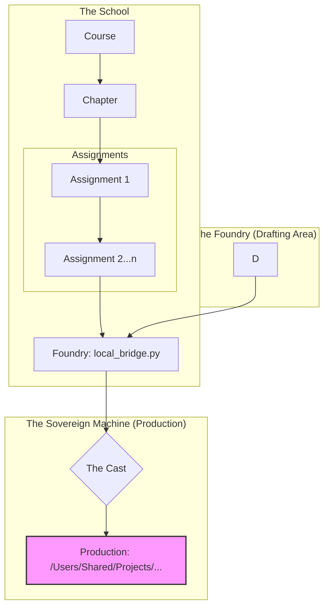

# The Killer Use Case: School of First Principles

**A sovereign learning system where AI agents help you learn by building, not by telling.**

> "To build a civilization, you need a shared truth. If two people write to the history book at the same time, one page gets torn out."

## 1. The Core Concept

The School of First Principles is a self-directed curriculum engine. It rejects the "Video & Quiz" model of EdTech in favor of the **"Atom & Foundry"** model of Sovereign Engineering.

**The Loop:**
1.  **Read**: You study the `assignment.md` (The immutable lesson).
2.  **Build**: You solve the `discovery.sh` (The proof of work).
3.  **Reflect**: You write the `reflection.md` (The verified understanding).
4.  **Cast**: You deploy to Production (The sovereign handover).

---

## 2. System Architecture

The School operates as a **Sovereign Domain** within the GAP ecosystem. It strictly isolates "Learning" vs "Production".



### The Security Model (GAP Enforcement)
1.  **Zero-Execution**: The AI Agents CANNOT run shell commands. They can only guide.
2.  **Reflective Locking**: No new Assignments unlock until the user's `reflection.md` is validated.
3.  **Manual Submission**: Only the User can move code from the **Workspace** to **Production**.

---

## 3. The Atomic Hierarchy

The curriculum is structured to minimize mental load while maximizing rigor.

| Unit | Description | Artifacts |
| :--- | :--- | :--- |
| **Campaign** | The high-level Goal (e.g., "Become Sovereign"). | `curriculum.md` |
| **Module** | A thematic container (e.g., "Local Anchoring"). | `intent.md` |
| **Atom** | The smallest unit of discovery. One concept, one proof. | `assignment.md`, `approval` |
| **Foundry** | The assembly area for complex systems. | `src/` |
| **Cast** | The deployment event. | `git commit` |

---

## 4. The Council (Agent Roles)

The School is staffed by specialized AI agents, ensuring the user receives holistic guidance.

| Role | Responsibility | Interaction Pattern |
| :--- | :--- | :--- |
| **Librarian** | **Map Keeper**. Manages prerequisites and cross-links. | "You cannot start X until Y is reflected." |
| **Tutor** | **Socratic Guide**. Delivers the lesson and validates reflection. | "Why did you use `chmod 777` here?" |
| **Critic** | **Code Auditor**. Reviews Foundry code for security/quality. | "This loop is O(n^2). optimize it." |
| **Smith** | **Blueprint Author**. Drafts the initial placeholders. | *Generates Markdown Blueprints* |

---

## 5. The Workflow (In Practice)

**Phase 1: The Assignment (Discovery)**
1.  **Tutor** presents `lesson.md`.
2.  **User** attempts the exercise (`assignment.sh`).
3.  **User** submits `reflection.md` proving they understand *why* it works.
4.  **Tutor** validates. If passed -> **Next Assignment Unlocked**.

**Phase 2: The Workspace (Assembly)**
1.  **User** completes all Assignments in a chapter.
2.  **System** unlocks the **Workspace**.
3.  **User** pulls code from Assignments to build the final system.
4.  **Tutor** reviews the assembly.

**Phase 3: The Submission (Deployment)**
1.  **User** triggers `gap gate submit`.
2.  **System** moves code from `foundry/` to the real `src/` directory.
3.  **Result**: The code is now "Production Ready".

---

## 6. How Instructors Build This (The Manual Curriculum Flow)

Instructors use GAP to scribe the curriculum. This is a **Manual, Step-by-Step** process, assisted by the **Course Writer** agent.

**Step 1: The Course (Define the Goal)**
*   **Instructor Action**: Create the course container.
    ```bash
    gap scribe intent "Sovereign User" --template course
    ```
*   **Artifact**: `courses/05/curriculum.md` (Draft)
*   **Gate**: Manual Review. You must edit and approve the file.
    ```bash
    gap gate approve "Sovereign User"
    ```

**Step 2: The chapter (Define the Theme)**
*   **Instructor Action**: Create the chapter container.
    ```bash
    gap scribe intent "Local Anchoring" --template chapter --parent "Sovereign User"
    ```
*   **Artifact**: `courses/05/chapters/04/intent.md` (Draft)
*   **Gate**: Manual Review.
    ```bash
    gap gate approve "Local Anchoring"
    ```

**Step 3: The Assignment (Define the Lesson)**
*   **Instructor Action**: Create the empty lesson shells.
    ```bash
    gap scribe content "Binary Discovery" --template assignment --parent "Local Anchoring"
    ```
*   **Artifacts**:
    *   `lesson.md` (Why/What)
    *   `assignment.sh` (The User's Target)
*   **Gate**: Manual Review. The Assignment is **LOCKED** to students until you approve it.
    ```bash
    gap gate approve "Binary Discovery"
    ```

**Step 4: The Bridging (Define the Assembly)**
*   **Instructor Action**: Define how these Assignments combine.
    ```bash
    gap scribe content "Anchoring Gate" --template assembly
    ```
*   **Gate**: Manual Review.
    ```bash
    gap gate approve "Anchoring Gate"
    ```

---

## 7. The Vision

### Why This is Brilliant
*   **Traditional Learning**: Watch video -> Forget.
*   **School of First Principles**: Build from scratch -> Own the knowledge.
*   **Portfolio**: Your git history *is* your resume. It proves you solved it.

### Future Features
*   **Agent SDK**: Real-time Socratic validation of `reflection.md`.
*   **Progress Dashboard**: Visual tree of unlocked/locked assignments.
*   **Portfolio Export**: HTML export of your learning journey.
