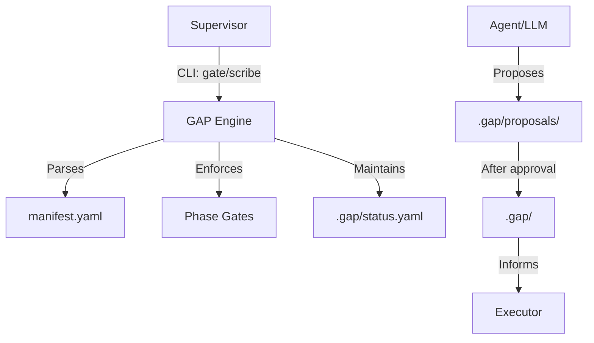

# Design: GAP Core System (Simplified)

## 1. System Architecture

### 1.1 High-Level Overview
The GAP system enforces human-gated workflows by managing the lifecycle of Markdown alignment artifacts and recording approvals in a transparent Ledger.

### 1.2 Core Components
1. **Manifest Parser** - Reads the project workflow and hierarchy.
2. **Gate Engine** - Manages state transitions (Proposal -> Live) and Ledger updates.
3. **Ledger** - The source of truth for all human decisions and state timestamps.
4. **Scribe** - Generator for Markdown templates in the proposals directory.

## 2. Component Design

### 2.1 Manifest System
**Location**: `src/gap/core/manifest.py`
**Responsibilities**:
- Parse YAML manifests with protocol inheritance.
- Detect transition dependencies (the `needs` field).

### 2.2 Alignment Artifacts
**Location**: `.gap/*.md`
**Responsibilities**:
- `idea.md`: High-level concept.
- `requirements.md`: Strategic intent.
- `design.md`: Technical structure.
- `tasks.md`: Tactical breakdown.
- `plan.md`: Execution authority (Model/Locality).

### 2.3 The Ledger
**Location**: `.gap/status.yaml`
**Responsibilities**:
- Map phase IDs to status (`complete`, `unlocked`, `locked`).
- Record the `approver`, `timestamp`, and `decision` for every gate event.

## 3. Workflow Design

### 3.1 The Gating Loop
1.  **Scribe**: Create a new artifact draft (`gap scribe create <step>`).
2.  **Drafting**: The agent/user fills out the Markdown in `.gap/proposals/`.
3.  **Gating**: The supervisor reviews and runs `gap gate approve <step>`.
4.  **Finalization**: The engine moves the file to `.gap/`, updates the Ledger, and unlocks the next step.

## 4. Security & Authority
- **Model Authorization**: `plan.md` defines which models are permitted for which phase.
- **Inference Locality**: `plan.md` defines where the computation is allowed to occur (Local vs Cloud).
- **Human Gating**: No action moves from "Intent" to "Authorized" without explicit human approval recorded in the Ledger.