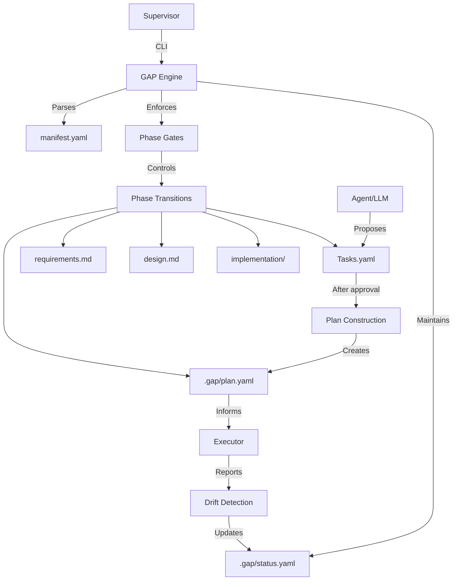
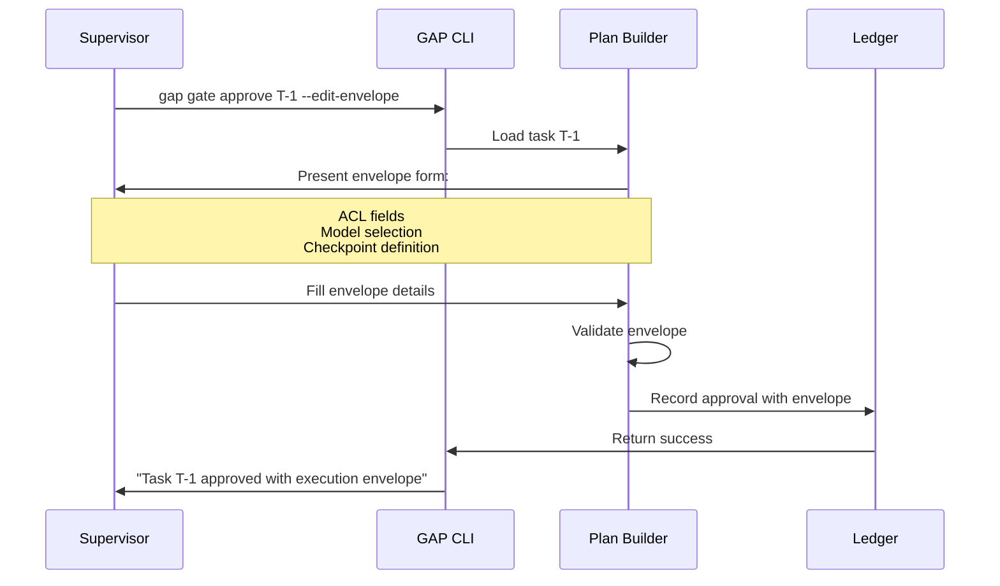

# Design: GAP Core System with Plan Layer

## 1. System Architecture

### 1.1 High-Level Overview
The GAP system enforces structured workflows through a deterministic protocol layer. The core innovation is separating **Tasks** (epistemic record of what must change) from **Plan** (operational record of how changes are allowed).



### 1.2 Core Components
1. **Manifest Parser** - Reads YAML workflow definition
2. **Gate Engine** - Enforces phase transitions and approvals
3. **Ledger** - Immutable record of all decisions
4. **Auditor** - Validates traceability and detects drift
5. **Plan Builder** - Constructs execution envelopes for approved tasks

## 2. Component Design

### 2.1 Manifest System (Req-1)
**Location**: `src/gap/core/manifest.py`
**Responsibilities**:
- Parse YAML manifest with protocol inheritance
- Validate phase dependencies and artifact paths
- Provide phase state query interface

**Schema**:
```yaml
# manifest.yaml
kind: project
name: my-project
extends:
  - protocol: software-engineering

flow:
  - step: requirements
    artifact: docs/requirements.md
    gate: true
    needs: []

  - step: design
    artifact: docs/design.md
    gate: true
    needs: [requirements]

  - step: tasks
    artifact: .gap/tasks.yaml
    view: docs/tasks.md
    gate: true
    needs: [design]

  - step: plan
    artifact: .gap/plan.yaml
    gate: true
    needs: [tasks]

  - step: implementation
    artifact: src/
    gate: false
    needs: [plan]
```

**Step Model Extension**:
The Step model needs to be extended to support the `view` field for human-readable representations:

```python
class Step(BaseModel):
    step: str
    name: Optional[str] = None
    artifact: str
    view: Optional[str] = None  # Human-readable view of artifact
    gate: bool = True
    needs: List[str] = Field(default_factory=list)
    # ... existing fields
```

### 2.2 Task Management (Req-2)
**Location**: `src/gap/core/models.py` (Task model) and `src/gap/core/task_sync.py` (new)
**Responsibilities**:
- Define pure task structure (no execution context)
- Validate traceability links
- Serialize/deserialize YAML
- Synchronize between YAML and Markdown formats

**Task Schema (Machine-readable)**:
```yaml
# .gap/tasks.yaml
tasks:
  - id: T-1
    description: "Implement authentication module"
    traces_to: D-03  # Design reference
    outputs:
      - src/auth.py
      - tests/test_auth.py
    rationale: "Required by R-02 (User authentication)"
    status: proposed  # proposed, approved, planned, executing, complete
```

**Task Rendering (Human-readable)**:
```markdown
# docs/tasks.md (rendered from .gap/tasks.yaml)
## Tasks

### T-1: Implement authentication module
- **Traces to**: Design D-03
- **Outputs**: 
  - `src/auth.py`
  - `tests/test_auth.py`
- **Rationale**: Required by Requirement R-02 (User authentication)
- **Status**: Proposed

[ ] T-1: Implement authentication module
```

**Sync Mechanism**:
1. **YAML → Markdown**: Automatic rendering when YAML changes
2. **Markdown → YAML**: Parse markdown changes back to YAML structure
3. **Conflict resolution**: Prefer YAML as source of truth, but preserve markdown edits
4. **Validation**: Ensure both formats remain consistent

### 2.3 Plan Layer (Req-3)
**Location**: `src/gap/core/plan.py` (New module)
**Responsibilities**:
- Attach execution envelopes to approved tasks
- Validate envelope completeness
- Provide Plan construction CLI interface

**Plan Schema**:
```yaml
# .gap/plan.yaml
plan:
  T-1:
    task_ref: T-1
    acl:
      filesystem:
        write:
          - src/auth.py
          - tests/test_auth.py
        read:
          - src/utils.py
      shell:
        - pytest
        - python -m build
    cognition:
      execution: local
      model: qwen3-coder-next
      justification: "Authentication code requires local execution for privacy"
    checkpoints:
      - after_implementation
      - before_merge
    approved_by: supervisor@example.com
    approved_at: 2026-02-22T10:30:00Z
```

### 2.4 Gate Engine (Req-4)
**Location**: `src/gap/commands/gate.py`
**Responsibilities**:
- Enforce phase transition rules
- Manage approval workflow
- Integrate with Plan construction for task approval

**Gate States**:
- `LOCKED` - Waiting for dependencies
- `UNLOCKED` - Ready for work
- `APPROVAL_PENDING` - Work complete, awaiting supervisor
- `APPROVED` - Supervisor approved, can proceed

### 2.5 Ledger System (Req-5)
**Location**: `src/gap/core/ledger.py`
**Responsibilities**:
- Record all state transitions and approvals
- Provide audit trail
- Detect drift between Plan and execution

**Ledger Entry**:
```yaml
entry:
  id: ledger-001
  timestamp: 2026-02-22T10:30:00Z
  phase: tasks
  action: approve
  task_id: T-1
  decision: approved_with_envelope
  envelope:
    acl: [as defined in plan]
    model: qwen3-coder-next
    checkpoints: [after_implementation]
  supervisor: user@example.com
```

### 2.6 CLI Interface (Req-6)
**Location**: `src/gap/commands/`
**Command Structure**:
- `gap check status` - Current gate states
- `gap check traceability` - Validate requirement→task links
- `gap scribe create <phase>` - Generate artifact templates
- `gap gate list` - Show pending approvals
- `gap gate approve <task-id> --edit-envelope` - Approve task with Plan construction
- `gap gate continue` - Resume after checkpoint

## 3. Workflow Design

### 3.1 Complete Lifecycle
```
Requirements (approved)
        ↓
Design (approved)
        ↓
Tasks proposed (agent) → Tasks approved (supervisor)
        ↓
Plan constructed (supervisor defines execution envelope)
        ↓
Implementation (gated by Plan checkpoints)
        ↓
Completion (ledger closed)
```

### 3.2 Plan Construction Flow


### 3.3 Drift Detection
**Mechanism**: Compare executed actions against Plan ACL
**Location**: `src/gap/core/auditor.py`
**Process**:
1. Executor reports actions (files touched, commands run)
2. Auditor compares against Plan ACL for each task
3. If violation detected, mark `INVALID` in ledger
4. Block further execution until supervisor review

## 4. Data Model

### 4.1 Core Entities
```python
class Task:
    id: str
    description: str
    traces_to: str  # Design ID
    outputs: List[str]
    rationale: str

class PlanEnvelope:
    task_id: str
    acl: ACLDefinition
    cognition: CognitionDefinition  
    checkpoints: List[str]
    approved_by: str
    approved_at: datetime

class ACLDefinition:
    filesystem: FilesystemACL
    shell: List[str]

class CognitionDefinition:
    execution: Literal["local", "cloud"]
    model: str
    justification: str

class LedgerEntry:
    id: str
    timestamp: datetime
    phase: str
    action: str
    task_id: Optional[str]
    decision: str
    envelope: Optional[PlanEnvelope]
    supervisor: str
```

### 4.2 File Structure
```
.gap/
├── status.yaml          # Current phase states
├── tasks.yaml          # Approved tasks (pure)
├── plan.yaml           # Execution envelopes
└── ledger.yaml         # Decision history

docs/
├── requirements.md
├── design.md
└── tasks.md           # Human-readable task list

src/                   # Implementation artifacts
```

## 5. Integration Points

### 5.1 Existing Codebase
- **`manifest.py`** - Extend to support Plan phase
- **`security.py`** - Rename to `scope_manifest.py` (parser only, no enforcement)
- **`checkpoint.py`** - Extend to honor Plan-defined checkpoints
- **`auditor.py`** - Add drift detection against Plan ACL

### 5.2 External Systems
- **Executors** - Read Plan for execution boundaries
- **Model Gateways** - Respect Plan's model assignments
- **CI/CD** - Use Plan for security context

## 6. Security Considerations

### 6.1 Principle: Declaration, Not Enforcement
- GAP declares what's allowed in Plan
- External systems may enforce (Docker, macOS sandbox, etc.)
- GAP detects and records violations

### 6.2 Audit Trail
- Every envelope approval recorded
- All execution actions logged
- Drift detection triggers audit flags

## 7. Testing Strategy

### 7.1 Unit Tests
- Manifest parsing and validation
- Task traceability validation
- Plan envelope construction
- Gate transition logic

### 7.2 Integration Tests
- Complete workflow lifecycle
- Plan construction CLI flow
- Drift detection scenarios
- Ledger audit trail

### 7.3 Property-Based Tests
- All valid manifests parse correctly
- All approved tasks have complete traceability
- All Plan envelopes validate against schema
- No state transitions bypass gates