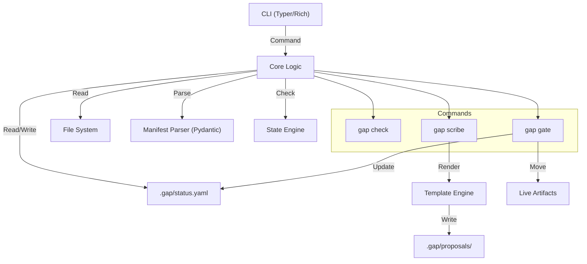

# Design: GAP Engine (The Architecture)

## 1. Overview
The GAP Engine is a stateless, sovereign CLI tool that enforces the Gated Agent Protocol. It relies on a `manifest.yaml` dependency graph to manage state transitions and uses Jinja2 templates for safe artifact generation.

## 2. Architecture


## 3. Components & Interfaces

### A. Manifest Parser (`gap.core.manifest`)
**Role**: The Source of Truth. Validates the `manifest.yaml` schema.
**Interface**:
```python
class GapManifest(BaseModel):
    kind: Literal['protocol', 'project']
    flow: List[Step]
    extends: Optional[List[ProtocolRef]]

class Step(BaseModel):
    step: str
    artifact: str
    gate: Literal['manual', 'auto']
    needs: List[str] = []

def load_manifest(path: Path) -> GapManifest: ...
```

### B. Path Manager (`gap.core.path`)
**Role**: The Resolver. Finds files across the Inheritance Chain.
**Interface**:
```python
def resolve_template(manifest: GapManifest, template_name: str) -> Path:
    """
    Search Order:
    1. Project/templates/{name}
    2. ParentProtocol/templates/{name}
    3. GrandParentProtocol/templates/{name}
    4. Raise FileNotFoundError
    """
```

### C. State Engine (`gap.core.state`)
**Role**: The "Brain". Determines which steps are Complete, Locked, or Unlocked.
**Interface**:
```python
class StepStatus(Enum):
    LOCKED = "locked"       # Dependencies not met
    UNLOCKED = "unlocked"   # Dependencies met, ready for Scribe
    PENDING = "pending"     # Proposal exists, waiting for Gate
    COMPLETE = "complete"   # File exists in Live & Ledger

class GapStatus(BaseModel):
    steps: Dict[str, StepData] # Map step_id -> {status, timestamp, approver}

def get_status(manifest: GapManifest, root: Path) -> GapStatus: ...
```

### C. The Scribe (`gap.commands.scribe`)
**Role**: The Generator. Safe writing mechanism.
**Interface**:
```python
def scribe(
    protocol: str, 
    template: str, 
    data: Dict[str, Any], 
    force_auto: bool = False
) -> CmdResult: ...
```

## 4. Correctness Properties (Formal Verification)
These properties must be verified by the Test Suite.

**Property 1: Schema Integrity**
*For any* `manifest.yaml`, the Parser MUST raise an error if required fields are missing or types are incorrect.
*(Validates Req 1)*

**Property 2: Dependency Locking**
*For any* Step N, the State Engine MUST return `LOCKED` if any `needs` (N-1) are not `COMPLETE`.
*(Validates Req 3 / Gate)*

**Property 3: Safe Write**
*For any* `manual` Gate step, Scribe MUST write to `.gap/proposals/` and NEVER to the live directory.
*(Validates Req 2 / Scribe)*

**Property 4: Auto Bypass**
*For any* `auto` Gate step, Scribe MUST write directly to the live directory, skipping the proposal phase.
*(Validates Req 2 / Scribe)*

**Property 5: Unmodified Live State**
*For any* `gap check` execution, the function MUST be Read-Only and NEVER modify the file system.
*(Validates Req 1 / Validator)*

## 5. Data Models
### JSON Output Standard
All commands via `--json` return this structure:
```json
{
  "status": "success|error",
  "data": { ... },
  "messages": ["Human readable logs"]
}
```
