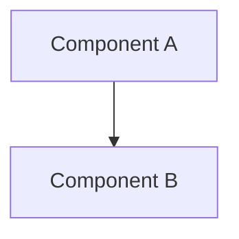

# Design: {{ feature_name }}

## 1. Architecture
{{ architecture_description }}

## 2. API / Interface
### `Function/Class Name`
*   **Input**: ...
*   **Output**: ...

## 3. Data Model
*   **Schema**: ...
